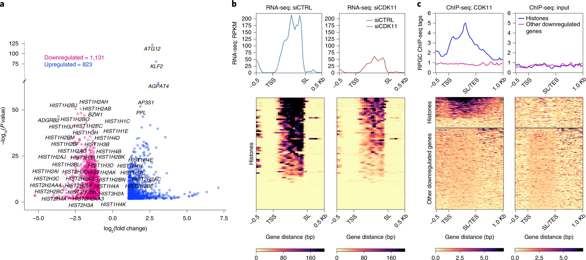
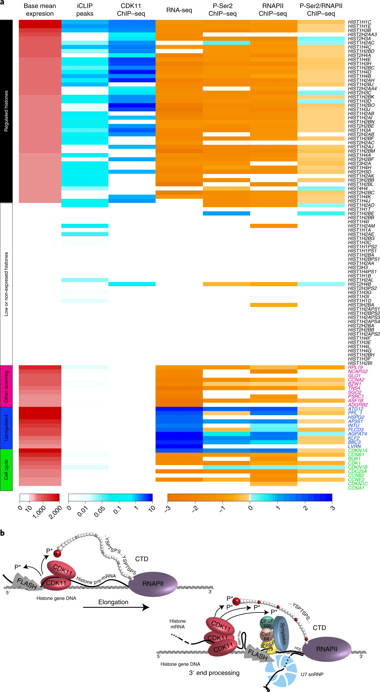
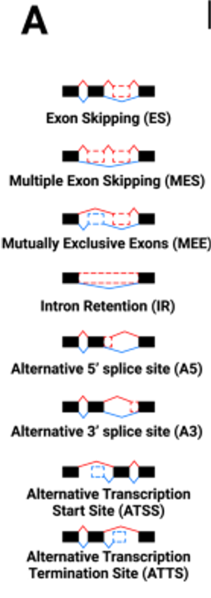

  
# Universidad de Navarra
# Máster en Métodos Computacionales en Ciencias
# Análisis e interpretación de datos de alto rendimiento    
  
# Introduction  
    
Students will be handed real human RNA-seq data (Pavla Gajdušková & Igor Ruiz de los Mozos  et al. 2020, NSMB) to investigate differential Transcript usagen (DTU) under different experimental conditions (please keep confidential)

Replication-dependent histones (RDH) are required for packaging of newly synthetized DNA into nucleosomes during the S phase when their expression is highly upregulated. However, the mechanisms of this upregulation in metazoan cells remain poorly understood. Using iCLIP and ChIP–seq, we found that human cyclin-dependent kinase 11 (CDK11) associates with RNA and chromatin of RDH genes primarily in the S phase. Moreover, its amino-terminal region binds FLASH, an RDH-specific 3′-end processing factor, which keeps the kinase on the chromatin. CDK11 phosphorylates serine 2 (Ser2) of the carboxy-terminal domain of RNA polymerase II (RNAPII), which is initiated when RNAPII reaches the middle of RDH genes and is required for further RNAPII elongation and 3′-end processing. CDK11 depletion leads to decreased number of cells in S phase, likely owing to the function of CDK11 in RDH gene expression. Thus, the reliance of RDH expression on CDK11 could explain why CDK11 is essential for the growth of many cancers.


  
  

## Data proccesing

The data processing for this practical was generated using a snakemake pipeline (Köster Bioinformatics 2012) to join and compute all the data in UNAV cluster. Attached report on ADI.

# Additional Reading  

This practical was extracted from manuals below under permissive licenses.  

    1 - Salmon Vignette   
          https://salmon.readthedocs.io/en/latest/salmon.html
  
    2 - IsoformSwitchAnalyzeR vignette    
          http://bioconductor.org/packages/release/bioc/vignettes/IsoformSwitchAnalyzeR/inst/doc/IsoformSwitchAnalyzeR.html   
    
    3 - RNA-seq DTU analisis by Michael Love    
          http://www.bioconductor.org/packages/release/workflows/vignettes/rnaseqDTU/inst/doc/rnaseqDTU.html
  
# Install and load R packages
 
```{r, warning = FALSE, message=FALSE}

# Install and load packages
# BiocManager::install("IsoformSwitchAnalyzeR")
library("IsoformSwitchAnalyzeR")
# BiocManager::install("DESeq2")
library("DESeq2")
# BiocManager::install("tidyverse")
library("tidyverse")
# BiocManager::install("dbplyr")
library("dbplyr")   
```

  
# Set path to your computer
  
```{r, warning = FALSE, message=FALSE}
# Set directory
# WARNIG, change to your system path!!!
# # Load directory from MAC
# directory <-"/Users/mozosi/Dropbox (UCL-MN Team)/Class/Unav2021/ML/DGE"

# Load directory from Windows
directory <- "C:/Users/d682011.ADMON-CFNAVARRA/OneDrive - NAVARRA SOCIEDADES PÚBLICAS/Others/classes/Unav2023/DTU"
setwd(directory)
list.files()


# Download a workspace with objects to workout this practical
# download.file("https://www.dropbox.com/s/kgczy695714gewg/DTU2.RData?raw=true", "DTU_download.RData", "auto", quiet = FALSE, mode = "wb")
# Alternatively you can directly download from html
# https://www.dropbox.com/s/kgczy695714gewg/DTU2.RData?dl=0

# load a workspace into the current session
# if you don't specify the path, the cwd is assumed
load("DTU_download.RData") 


```
 
 

# Workflow overview

First we will start by getting an overview of the detailed workflow before diving into the individual parts. Then we will introduce the IsoformSwitchAnalyzeR Background Information - all you need to know before doing the detailed analysis. This is followed by a detailed step-by-step isoform switch analysis workflow and lastly an overview of useful Other Tools in IsoformSwitchAnalyzeR is provided.


The detailed workflow consists of the following steps (illustrated in below Figure) which, just like before, can be divided into eight parts:


    1 - Importing Data Into R
        Importing Data from Salmon
 
    2 - Filtering
    
    3 - Identifying Isoform Switches
          Analyzing Open Reading Frames
          Extracting Nucleotide and Amino Acid Sequences
    
    4 - Predicting Alternative Splicing

    5 - Analysis of Individual Isoform Switching
    
    6 - Genome-Wide Analysis of Isoform Switching
    
    7 - Predicting Switch Consequences 
    

  

# **Step 1** Import Salmon-quantification into R

```{r, warning = FALSE, message=FALSE, eval = FALSE}

### Please note
# The way of importing files in the following example with "IsoformSwitchAnalyzeR"
# parentDir = "/mySalmonQuantifications/" pointing to the parent directory (where 
# each sample is a seperate sub-directory) to the function.

### Import Salmon example data in R package
## This data is already loaded in your R.Environment 
# salmonQuant <- importIsoformExpression(
#   parentDir = "/Users/mozosi/Desktop/HPC/Dali/Salmon_transcript_RNAseq/salmon/",
#   addIsofomIdAsColumn = TRUE
# )


#> Step 1 of 3: Identifying which algorithm was used...
#>     The quantification algorithm used was: Salmon
#>     Found 6 quantification file(s) of interest
#> Step 2 of 3: Reading data...
#> reading in files with read_tsv
#> 1 2 3 4 5 6 
#> Step 3 of 3: Normalizing abundance values (not counts) via edgeR...
#> Done


### Make design matrix
# The design matrix (a data.frame with two mandatory columns: sampleID and condition) also allows 
# for incorporation of additional cofactors in the experimental setup (such as batch effects) 
# - simply add these to the design matrix as additional columns and IsoformSwitchAnalyzeR will handle the rest 

myDesign <- data.frame(
  sampleID = colnames(salmonQuant$abundance)[-1],
  condition = c("DMSO", "OTS964_30nM", "OTS964_300nM","DMSO", "OTS964_30nM", "OTS964_300nM")
)
# Check desing
View(myDesign)
#                       sampleID    condition
# 1         109116_AGTCAA_DMSO_1         DMSO
# 2  109117_AGTTCC_30nM_OTS964_1  OTS964_30nM
# 3 109118_ATGTCA_300nM_OTS964_1 OTS964_300nM
# 4         109119_CCGTCC_DMSO_2         DMSO
# 5  109120_GTCCGC_30nM_OTS964_2  OTS964_30nM
# 6 109121_GTGAAA_300nM_OTS964_2 OTS964_300nM


```

```{r, warning = FALSE, message=FALSE}
# Explore dataset
head(salmonQuant$abundance, 2)
head(salmonQuant$counts, 2)
```
    
    
# Import data and create SwitchAnalyzeRlist

```{r, warning = FALSE, message=FALSE, eval = FALSE}
### Step (1) Import data and create SwitchAnalyzeRlist
### Create switchAnalyzeRlist
aSwitchList <- importRdata(
  isoformCountMatrix   = salmonQuant$counts,
  isoformRepExpression = salmonQuant$abundance,
  designMatrix         = myDesign,
  isoformExonAnnoation = "/Users/mozosi/Dropbox (UCL-MN Team)/Class/Unav2021/ML/DTU/gencode.v33.primary_assembly.annotation.gtf",
  isoformNtFasta       = "/Users/mozosi/Dropbox (UCL-MN Team)/Class/Unav2021/ML/DTU/transcripts.fa",
  fixStringTieAnnotationProblem = TRUE,
  showProgress = FALSE
)

# Step 1 of 7: Checking data...
# Step 2 of 7: Obtaining annotation...
#     importing GTF (this may take a while)
# Done.
#     83023 ( 36.73%) isoforms were removed since they were not expressed in any samples.
# Step 3 of 7: Fixing StringTie gene annoation problems...
#     There were no need to fix any annotation
# Step 4 of 7: Calculating gene expression and isoform fractions...
# Step 5 of 7: Merging gene and isoform expression...
# Step 6 of 7: Making comparisons...
# Step 7 of 7: Making switchAnalyzeRlist object...
# The GUESSTIMATED number of genes with differential isoform usage are:
#                   comparison estimated_genes_with_dtu
# 1        OTS964_300nM - DMSO              2200 - 3667
# 2         OTS964_30nM - DMSO              2481 - 4135
# 3 OTS964_30nM - OTS964_300nM                174 - 290
# Done
# 
# Warning message:
# In importRdata(isoformCountMatrix = salmonQuant$counts, isoformRepExpression = salmonQuant$abundance,  :
#   The annotation and quantification (count/abundance matrix and isoform annotation) Seem to be slightly different. 
# Specifically:
#  285 isoforms were only found in the annotation
#  
# Please make sure this is on purpouse since differences will cause inaccurate quantification and thereby skew all analysis.
#  If you have quantified with Salmon this could be normal since it as default only keep one copy of identical sequences (can be prevented using the --keepDuplicates option)
#  We strongly encourage you to go back and figure out why this is the case.


# save the workspace to the file .RData in the cwd
# save(salmonQuant, myDesign, aSwitchList, file="DTU.RData") 
```

```{r, warning = FALSE, message=FALSE}
# get some summary report
summary(aSwitchList)
```
  
# **Step 2** Prefilter
  
By using preFilter() it is possible to remove genes and isoforms from all aspects of the switchAnalyzeRlist by filtering on:

    Multi-isoform genes
    Gene expression
    Isoform expression
    Isoform Fraction (isoform usage)
    Unwanted isoform classes
    Unwanted gene biotypes
    Genes without differential isoform usage

Removal of single isoform genes is the default setting in preFilter() since these genes, per definition, cannot have changes in isoform usage. The filter on Isoform Fraction allows removal of isoforms that only contribute minimally to the gene expression thereby speeding up and simplifying the rest of the downstream analysis without losing important isoforms.

```{r, warning = FALSE, message=FALSE}
### Step (2) Prefilter
### Filter
mySwitchList <- preFilter( aSwitchList )
```


# **Step 3** Identify differentially used isoforms with DEXSeq

The DEXSeq package was originally designed for detecting differential exon usage (Anders, Reyes, and Huber 2012), but can also be adapted to run on estimated transcript counts, in order to detect DTU. Using DEXSeq on transcript counts was evaluated by Soneson et al. (2016), showing the benefits in FDR control from filtering lowly expressed transcripts for a transcript-level analysis. We benchmarked DEXSeq here, beginning with the DRIMSeq filtered object, as these filters are intuitive, they greatly speed up the analysis, and such filtering was shown to be beneficial in FDR control.
The two factors of (1) working on isoform counts rather than individual exons and (2) using the DRIMSeq filtering procedure dramatically increase the speed of DEXSeq, compared to running an exon-level analysis. Another advantage is that we benefit from the sophisticated bias models of Salmon, which account for drops in coverage on alternative exons that can otherwise throw off estimates of transcript abundance (Love, Hogenesch, and Irizarry 2016). A disadvantage over the exon-level analysis is that we must know in advance all of the possible isoforms that can be generated from a gene locus, all of which are assumed to be contained in the annotation files (FASTA and GTF).
We first load the DEXSeq package and then build a DEXSeqDataSet from the data contained in the dmDStest object (the class of the DRIMSeq object changes as the results are added). The design formula of the DEXSeqDataSet here uses the language “exon” but this should be read as “transcript” for our analysis. DEXSeq will test – after accounting for total gene expression for this sample and for the proportion of this transcript relative to the others – whether there is a condition-specific difference in the transcript proportion relative to the others.

```{r, warning = FALSE, message=FALSE, eval = FALSE}
### NOT NEEDED, JUST ADDED FOR TO INTERPRET THE MODEL!!!
# library(DEXSeq)
sample.data <- DRIMSeq::samples(d)
count.data <- round(as.matrix(counts(d)[,-c(1:2)]))
dxd <- DEXSeqDataSet(countData=count.data,
                     sampleData=sample.data,
                     design=~sample + exon + condition:exon,
                     featureID=counts(d)$feature_id,
                     groupID=counts(d)$gene_id)
```

Functions performing the differential isoform usage test that enables switch identification.

```{r, warning = FALSE, message=FALSE}
### Test for isoform switches
mySwitchList <- isoformSwitchTestDEXSeq( switchAnalyzeRlist = mySwitchList, reduceToSwitchingGenes=T )   # OR
# Step 1 of 2: Testing each pairwise comparisons with DEXSeq (this might be a bit slow)...
#     Estimated time (for dataset with ~30.000 isoforms): 3.3 min
#   |===================================================================================================================================================================| 100%
# Step 2 of 2: Integrating result into switchAnalyzeRlist...
#     Isoform switch analysis was performed for 30743 gene comparisons (100%).
# Total runtime: 14.11 min
# Done
# Warning messages:
# 1: In DESeqDataSet(rse, design, ignoreRank = TRUE) :
#   some variables in design formula are characters, converting to factors
# 2: In DESeqDataSet(rse, design, ignoreRank = TRUE) :
#   some variables in design formula are characters, converting to factors
# 3: In DESeqDataSet(rse, design, ignoreRank = TRUE) :
#   some variables in design formula are characters, converting to factors


# Summarize switching features
extractSwitchSummary(mySwitchList)

### If novel isoforms (else use CDS from ORF as explained in importRdata() )
# Once the isoform switches have been found, the next step is to annotate the isoforms involved in the isoform 
# switches. The first step in such annotation is to obtain Open Reading Frames (ORFs).
mySwitchList <- analyzeORF( mySwitchList )

### Extract Sequences
mySwitchList <- extractSequence( mySwitchList )

### Summary
extractSwitchSummary(mySwitchList)

### Get isoform Features
head(mySwitchList$isoformFeatures,5)
### Get exons
head(mySwitchList$exons,2)
### Get sequences
head(mySwitchList$ntSequence,2)
```

# **Step 4** Analyze alternative splicing

Another type of annotation we easily can obtain, since we know the exon structure of all isoforms in a given gene (with isoform switching), is alternative splicing. Here intron retention events are of particular interest as a consequence in isoform switches since they represent the largest changes in isoforms. Identification of alternative splicing, alternative transcription start and termination sites can be obtained via the analyzeAlternativeSplicing().

Since the comparison is to the hypothetical pre-RNA the interpretation of an event is as follows:

ES: Exon Skipping. Compared to the hypothetical pre-RNA a single exon was skipped in the isoform analyzed (for every ES event annotated).
MEE: Mutually exclusive exon. Special case were two isoforms form the same gene contains two mutually exclusive exons and which are not found in any of the other isoforms from that gene.
MES: Multiple Exon Skipping. Compared to the hypothetical pre-RNA multiple consecutive exon was skipped in the isoform analyzed (for every MES event annotated).
IR: Intron Retention. Compared to the hypothetical pre-RNA an intron was retained in the isoform analyzed.
A5: Alternative 5'end donor site. Compared to the hypothetical pre-RNA an alternative 5'end donor site was used. Since it is compared to the pre-RNA, the donor site used is per definition more upstream than the the pre-RNA (the upstream exon is shorter).
A3: Alternative 3'end acceptor site. Compared to the hypothetical pre-RNA an alternative 3'end acceptor site was used. Since it is compared to the pre-RNA, the donor site used is per definition more downstream than the the pre-RNA (the downstream exon is shorter).
ATSS: Alternative Transcription Start Sites. Compared to the hypothetical pre-RNA an alternative transcription start sites was used. Since it is compared to the pre-RNA, the ATSS site used is per definition more downstream than the the pre-RNA .
ATTS: Alternative Transcription Termination Sites. Compared to the hypothetical pre-RNA an alternative transcription Termination sites was used. Since it is compared to the pre-RNA, the ATTS site used is per definition more upstream than the the pre-RNA.
  


```{r, warning = FALSE, message=FALSE}
### Step (4) Analyze alternative splicing
mySwitchList <- analyzeAlternativeSplicing(
  switchAnalyzeRlist = mySwitchList,
  quiet=TRUE
)

### Step (4.1) Analyze Intron Retention
mySwitchList <-analyzeIntronRetention(
  switchAnalyzeRlist = mySwitchList,
  onlySwitchingGenes = TRUE,
  alpha = 0.05,
  dIFcutoff = 0.1,
  showProgress = TRUE,
  quiet = TRUE
)
# Step 1 of 3: Massaging data...
# Step 2 of 3: Analyzing splicing...
#   |================================================================================================================| 100%
# Step 3 of 3: Preparing output...
# Done
# Done

# Save an object to a file
#saveRDS(mySwitchList, file = "mySwitchList_data.rds")

# Restore the object. In case you will need to restore the data object
# mySwitchList <- readRDS(file = "mySwitchList_data.rds")

### Extract 10 top switching genes (by q-value)
extractTopSwitches(
    mySwitchList, 
    filterForConsequences = F, 
    n = 10, 
    sortByQvals = TRUE
)


```


# **Step 5** Analysis of Individual Isoform Switching

When analyzing the individual genes with isoform switches, the genes/isoforms with the largest changes in isoform usage (i.e. “most” switching genes/isoforms) are of particular interest. IsoformSwitchAnalyzeR can help you obtain these, either by sorting for the smallest q-values (obtaining the genes with the most significant switches) or the largest absolute dIF values (extracting the genes containing the switches with the largest effect sizes (which are still significant)). Both methods are implemented at both genes and isoforms levels in the extractTopSwitches() function and the sorting algorithm is controlled via the sortByQvals argument.

```{r, warning = FALSE, message=FALSE}

# Visualise gene transcripts variants
switchPlotTranscript(mySwitchList, gene="DKK1") # Visualizes the transcripts and their annotation
# Visualizes the gene expression
switchPlotGeneExp(mySwitchList, gene="DKK1", condition1 = 'DMSO',condition2 = 'OTS964_30nM', localTheme = theme_bw(base_size = 9)) 
# Visualizes the isoform expression
switchPlotIsoExp(mySwitchList, gene="DKK1", condition1 = 'DMSO',condition2 = 'OTS964_30nM', localTheme = theme_bw(base_size = 9))  # Visualizes the isoform usage   
switchPlotIsoUsage(mySwitchList, gene="DKK1", condition1 = 'DMSO',condition2 = 'OTS964_30nM', localTheme = theme_bw(base_size = 9))   


### Summary
extractSwitchSummary(mySwitchList, filterForConsequences = F)


TopSwitches <- extractTopSwitches(mySwitchList, filterForConsequences = F, n=100)
write.table(as.data.frame(TopSwitches), file=paste("TopSwitches.tab", sep=""), row.names = T,col.names = TRUE, sep="\t")

# Plot the 10 most DTU transcripts  
for(i in 1:10) {
  # i-th element of 10
  gene_name<- TopSwitches$gene_name[i]
  pdf(file = paste('DMSO_Vs_OTS964_30nM_', gene_name, ".pdf", sep = ""), onefile = FALSE, height=10, width = 15)
  switchPlot(mySwitchList, gene=gene_name, condition1 = 'DMSO',condition2 = 'OTS964_30nM', localTheme = theme_bw(base_size = 9))
  dev.off()
}

# Example of a gene that doesn't change in DGE but is significant on DTU!
# pdf(file = paste("switchPlot", "BRCA2", ".pdf", sep = ""), onefile = FALSE, height=10, width = 15)
switchPlot(mySwitchList, gene="BRCA2", condition1 = 'DMSO',condition2 = 'OTS964_30nM', localTheme = theme_bw(base_size = 9))
# dev.off()


switchPlot(mySwitchList, gene="DKK1", condition1 = 'DMSO',condition2 = 'OTS964_30nM', localTheme = theme_bw(base_size = 9))


switchPlot(mySwitchList, gene="HSPA8", condition1 = 'DMSO',condition2 = 'OTS964_30nM', localTheme = theme_bw(base_size = 9))

```


# **Step 6** Genome-Wide Analysis of Alternative Splicing

The genome-wide analysis of splicing patterns is facilitated by the following four functions:

    * extractSplicingSummary()
    * extractSplicingEnrichment()
    * extractSplicingEnrichmentComparison()
    * extractSplicingGenomeWide()

The extractSplicingSummary function does exactly what it says on the tin - it summarizes the number of events found in each comparison. To showcase it, let’s look at some already analyzed example data (meaning step previous have already been done).
Note that it is possible to both summarize per gene or per isoform via the plotGenes argument and that the asFractionTotal argument enables analysis the fraction (if TRUE) or Number (if FALSE) of significant isoforms/genes which have a particular splice type.

```{r, warning = FALSE, message=FALSE}

extractSplicingSummary( mySwitchList)

extractSplicingEnrichment( mySwitchList)

extractSplicingEnrichmentComparison( mySwitchList)

extractSplicingGenomeWide( mySwitchList)

```


# **Step 7** Predicting Switch Consequences

If an isoform has a significant change in its contribution to gene expression, there must per definition be reciprocal changes in one (or more) isoforms in the opposite direction, compensating for the change in the first isoform. We utilize this by extracting the isoforms that are significantly differentially used and compare them to the isoforms that are compensating. Using all the information gathered through the workflow described above, the annotation of the isoform(s) used more (positive dIF) can be compared to the isoform(s) used less (negative dIF) and by systematically identify differences annotation we can identify potential function consequences of the isoform switch.

Specifically, IsoformSwitchAnalyzeR contains a function analyzeSwitchConsequences() which extracts the isoforms with significant changes in their isoform usage (defined by the alpha and dIFcutoff parameters, see Identifying Isoform Switches for details) and the isoform, with a large opposite change in isoform usage (also controlled via the dIFcutoff parameters) that compensate for the changes. Note that if an isoform-level test was not used, the gene is require to be significant (defined by the alpha parameter); but, isoforms are then selected purely based on their changes in dIF values.


```{r, warning=FALSE, message=FALSE,eval=F, echo=T}


# analyzeSwitchConsequences
consequencesOfInterest <- c('intron_retention','coding_potential','NMD_status','domains_identified','ORF_seq_similarity')

exampleSwitchListAnalyzed <- analyzeSwitchConsequences(
    mySwitchList,
    consequencesToAnalyze = consequencesOfInterest, 
    dIFcutoff = 0.4, # very high cutoff for fast runtimes - you should use the default (0.1)
    showProgress=FALSE
)

```


# References    

* Soneson et al. Differential analyses for RNA-seq: transcript-level estimates improve gene-level inferences. F1000Research 4, 1521 (2015). link.

* Robinson et al. A scaling normalization method for differential expression analysis of RNA-seq data. Genome Biology (2010) link.

* Vitting-Seerup et al. The Landscape of Isoform Switches in Human Cancers. Cancer Res. (2017) link. http://mcr.aacrjournals.org/content/15/9/1206.long

* Vitting-Seerup et al. IsoformSwitchAnalyzeR: Analysis of changes in genome-wide patterns of alternative splicing and its functional consequences. Bioinformatics (2019) link. http://dx.doi.org/10.1093/bioinformatics/btz247

* Ritchie et al. limma powers differential expression analyses for RNA-sequencing and microarray studies. Nucleic Acids Research (2015) link.

* Anders et al. Detecting differential usage of exons from RNA-seq data. Genome Research (2012) link.

* Köster, Johannes and Rahmann, Sven. “Snakemake - A scalable bioinformatics workflow engine”. Bioinformatics 2012.

* Gajdušková, P., Ruiz de los Mozos, I., Rájecký, M. et al. CDK11 is required for transcription of replication-dependent histone genes. Nat Struct Mol Biol 27, 500–510 (2020). https://doi.org/10.1038/s41594-020-0406-8
  
  
# Session Info    

We should always keep record of the R packages used and their versions. In some cases you could get different results with different packages version!!  
  
  
  ```{r}
devtools::session_info()
```
