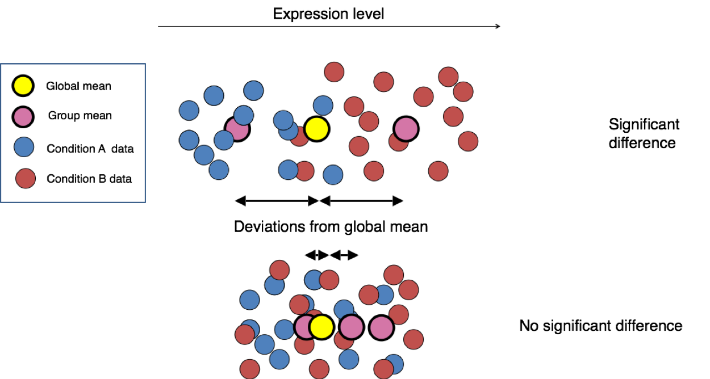
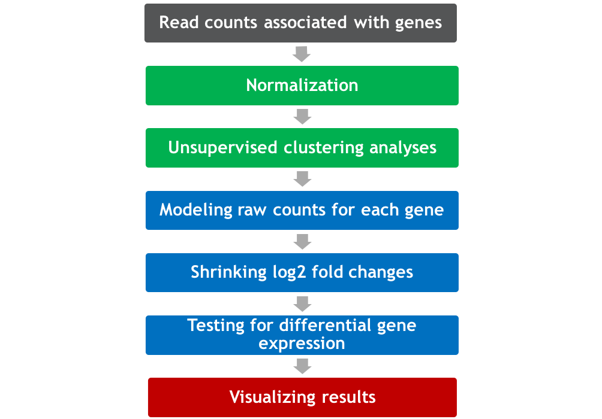
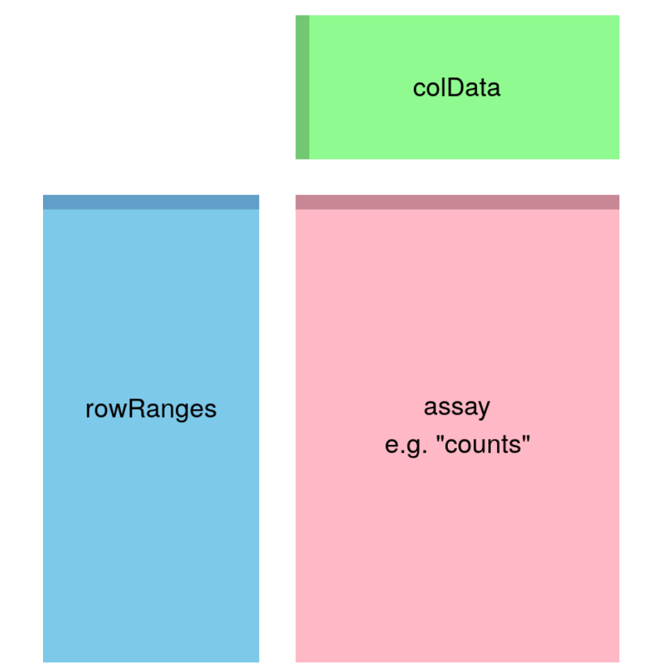
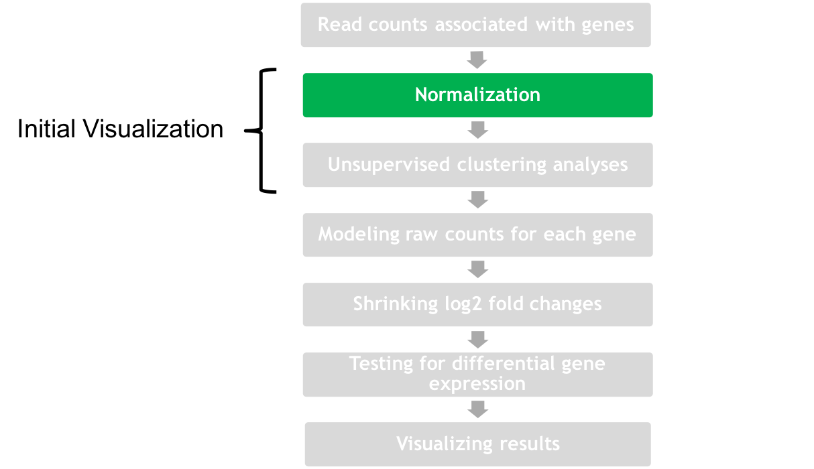
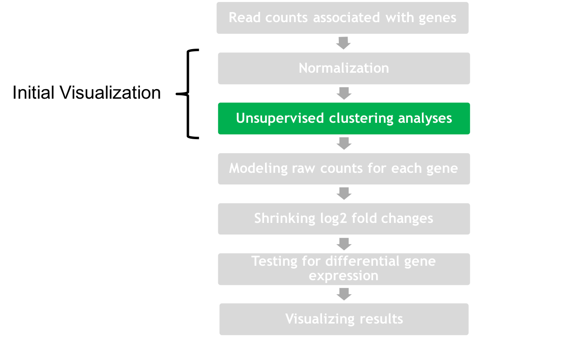
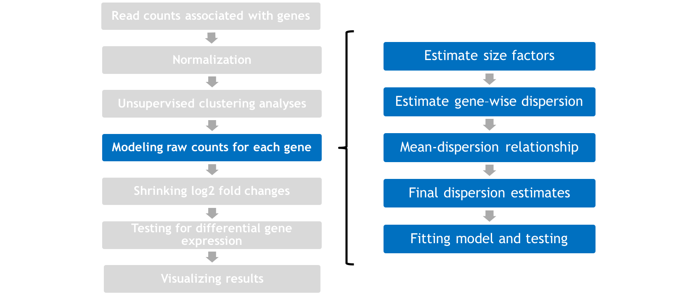
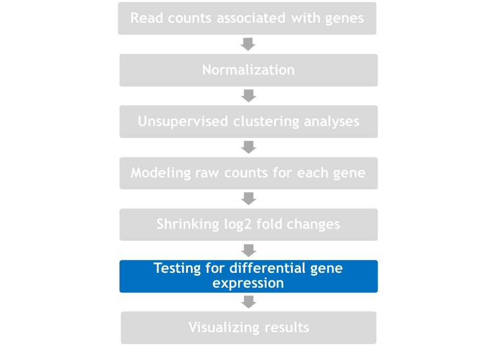
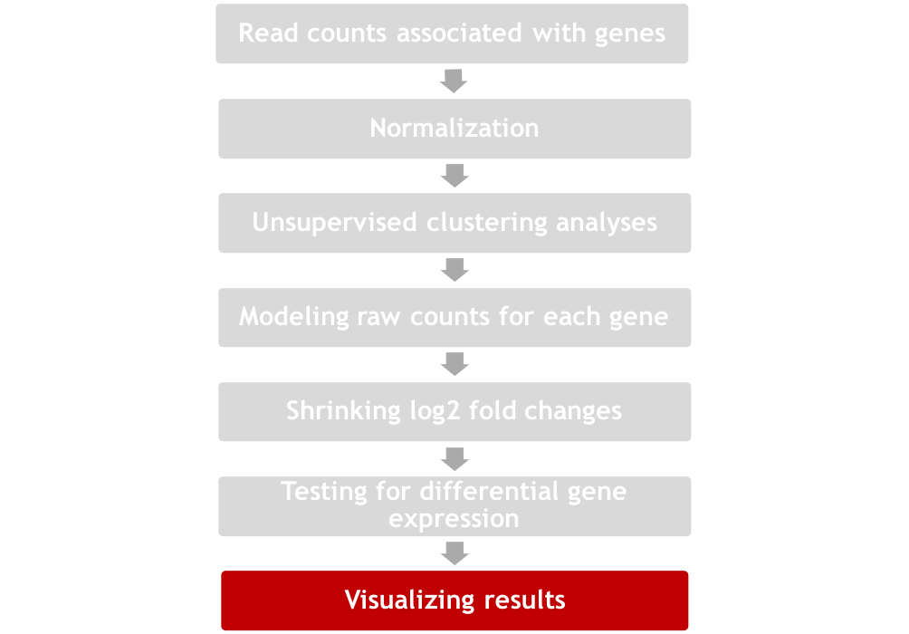
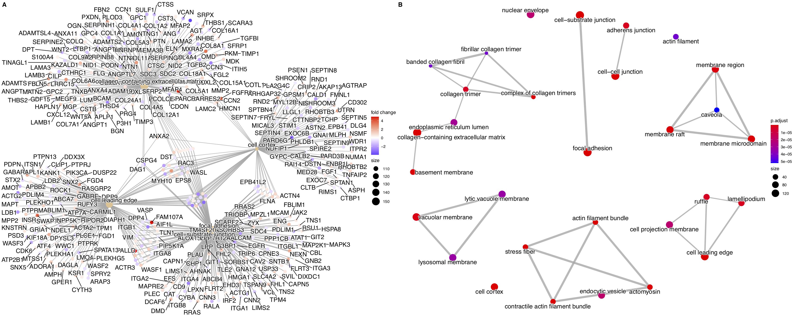

    
# Universidad de Navarra
## Máster en Métodos Computacionales en Ciencias
## Análisis e interpretación de datos de alto rendimiento 
 
# Introduction  
  
Students will be handed real human RNA-seq data (Himes et al 2014) to investigate differential gene expression (DGE) under different experimental conditions.  

Characterization transcriptomic changes in four primary human ASM cell lines that were treated with dexamethasone — a potent synthetic glucocorticoid (1 /$\mu$M for 18 hours). R and Bioconductor statistical packages to research variation at gene level. R studio NGS visualization technologies will be used to display gene expression differences and gene ontology to infer biological meaning of their findings.

      
# Additional Reading and Credits
  
  
This practice material was adapted from Michael Love, DeSeq2 tutorial 2018 (kindly authorized us to reproduce). RNA-seq workflow: gene-level exploratory analysis and differential expression. 2018 **  

https://www.bioconductor.org/packages/devel/workflows/vignettes/rnaseqGene/inst/doc/rnaseqGene.html  

Introduction to DGE. Teaching materials at the Harvard Chan Bioinformatics Core *These are open access materials distributed under the terms of the Creative Commons Attribution license (CC BY 4.0), which permits unrestricted use, distribution, and reproduction in any medium, provided the original author and source are credited.*
https://hbctraining.github.io/DGE_workshop/lessons/04_DGE_DESeq2_analysis.html  
  
Introduction to differential gene expression analysis using RNA-seq.
Friederike Dündar, Luce Skrabanek, Paul Zumbo 2015 *
http://chagall.med.cornell.edu/RNASEQcourse/Intro2RNAseq.pdf  

Interesting paper describing all the steps in a RNA-seq DGE experiment **
Conesa A, Madrigal P, Tarazona S, et al. A survey of best practices for RNA-seq data analysis. Genome Biology. 2016;17:13. doi:10.1186/s13059-016-0881-8.  

Love, Michael I., et al. "RNA-Seq workflow: gene-level exploratory analysis and differential expression." F1000Research 4 (2015). *


  
#### List of RNA-Seq bioinformatics tools  
  
Extensive list of RNA-seq bioinformatic tools.  

https://en.wikipedia.org/wiki/List_of_RNA-Seq_bioinformatics_tools  
  
  

# Differential gene expression using R and Bioconductor packages.  

```{r}

```

    
  
#### DGE bioinformatic schema  
   
    
     
     
    
    
      
      
#### Airway data load   
   
    
  
```{r, warning = FALSE, message=FALSE, results='hide', cache=TRUE,  eval = FALSE} 
# # Download BiocManager
# if (!requireNamespace("BiocManager", quietly = TRUE))
#   install.packages("BiocManager")
# # Download airway library
# BiocManager::install("airway")


## For old R distribution <4.0
# source("https://bioconductor.org/biocLite.R")
# #biocLite("airway")
# if (!require(airway)) {
#     install.packages("airway")
#     require(airway)
# }


```   
   
```{r, warning = FALSE, message=FALSE}
# Load airway
library("airway")

# Install and load SummarizedExperiment
# BiocManager::install("SummarizedExperiment")
library("SummarizedExperiment")

# Check airway vignette
# vignette("airway")

# Load airway data
data("airway")


# Assign airway data to summarized experiment R object 
se <- airway


# Set directory
# WARNIG, change to your system path!!!

# # Load directory from MAC
# directory <-"/Users/mozosi/Dropbox (UCL-MN Team)/Class/Unav2021/ML/DGE"

# Load directory from Windows
# directory <- "C:/Users/d682011.ADMON-CFNAVARRA/OneDrive - NAVARRA SOCIEDADES PÚBLICAS/Others/classes/Unav2023"
directory <- "/home/rstudio"

setwd(directory)
list.files()


# Save an object to a file
saveRDS(se, file = "se_data.rds")

# Restore the object. In case you will need to restore the data object
# readRDS(file = "se_data.rds")

```
  
# Summarized experiment.  
  
The component parts of a SummarizedExperiment object. The assay (pink block) contains the matrix of counts, the rowRanges (blue block) contains information about the genomic ranges and the colData (green block) contains information about the samples. The highlighted line in each block represents the first row (note that the first row of colData lines up with the first column of the assay).  

  


```{r}


# Total sum of read counts
colSums(assay(se))

# Head of summarizeexperiment object
head(assay(se), 3)

# Gene genomic ranges with genomic ranges
rowRanges(se)
# Metada contained in the ranges
str(metadata(rowRanges(se)))

# Annotation of the experiment
colData(se)

# Check object attributes and class
#attributes(se)
class(se)
```
  
 
   
  
# Differential gene expression with DeSeq2  
  
DeSeq2 is one of the most widely used DGE packages (Love 2014).   
* Don’t assume that variance and median are equal – not normally distributed. 
* Allow global variance and check the variance of a single gene versus the rest and whether the changes are due to chance.
* In essence, we are testing if the mean expression are significantly different. The null hypothesis is that there is no systematic difference between the average read count values of the different conditions for a given gene. 

    
      
       
```{r, eval = FALSE,  cache=TRUE}
# Download DeSeq2 if necesary
# if (!require(DESeq2)) {
#     install.packages("DESeq2")
#     require(DESeq2)
# }
# BiocManager::install("DESeq2")
# BiocManager::install("DelayedArray")


```


## The DESeq2 model

The DESeq2 model and all the steps taken in the software are described in detail in our publication (Love, Huber, and Anders 2014), and we include the formula and descriptions in this section as well. The differential expression analysis in DESeq2 uses a generalized linear model of the form:

$\verb**Kij "~" NB(/$\mu$ij,/$\alpha$i)**$

$\verb**/$\mu$ij=sjqij**$

$\verb**log2(qij)=xj./$\beta$i**$

where counts **Kij** for gene i, sample j are modeled using a negative binomial distribution with fitted mean /$\mu$ij and a gene-specific dispersion parameter /$\alpha$i. The fitted mean is composed of a sample-specific size factor sj and a parameter qij proportional to the expected true concentration of fragments for sample j. The coefficients /$\beta$i give the log2 fold changes for gene i for each column of the model matrix X. Note that the model can be generalized to use sample- and gene-dependent normalization factors sij

.

The dispersion parameter */$\alpha$i* defines the relationship between the variance of the observed count and its mean value. In other words, how far do we expected the observed count will be from the mean value, which depends both on the size factor sj and the covariate-dependent part *qij* as defined above.

$\verb**Var(Kij)=E[(Kij-/$\mu$ij)2]=/$\mu$ij+/$\alpha$i/$\mu$2ij**$

An option in DESeq2 is to provide maximum a posteriori estimates of the log2 fold changes in */$\beta$i* after incorporating a zero-centered Normal prior (betaPrior). While previously, these moderated, or shrunken, estimates were generated by DESeq or nbinomWaldTest functions, they are now produced by the lfcShrink function. Dispersions are estimated using expected mean values from the maximum likelihood estimate of log2 fold changes, and optimizing the Cox-Reid adjusted profile likelihood, as first implemented for RNA-seq data in edgeR (Cox and Reid 1987,edgeR_GLM). The steps performed by the DESeq function are documented in its manual page DESeq; briefly, they are:

1. estimation of size factors sj by *estimateSizeFactors*
2. estimation of dispersion /$\alpha$i by *estimateDispersions*
3. negative binomial GLM fitting for /$\beta$i and Wald statistics by *nbinomWaldTest*

For access to all the values calculated during these steps, see the link below

http://bioconductor.org/packages/devel/bioc/vignettes/DESeq2/inst/doc/DESeq2.html#access
  
    

```{r message=FALSE, warning=FALSE}
# Load DeSeq2
library("DESeq2")

# Order of factors before relevel
se$dex
# When we talk about differentially gene expression (DGE) we are looking for changes in expression on 
# the treatment Vs control. Relevel untreated samples (Note: it is preferred in R that the first level 
# of a factor be the reference level (e.g. control, or untreated samples), so we can relevel the dex 
# factor. DeSeq2 will consider the first level as control and will perform pair-wise comparisons where 
# first factor is the denominator on the fold change variation.  

se$dex <- relevel(se$dex, "untrt")
# Order of factors after relevel. Untreated came to the first position on the factors levels
se$dex

# Construct a DESeqDataSet data object
dds_raw <- DESeqDataSet(se, design = ~ cell + dex)
```

## Note on sample comparision

 # DO NOT RUN!
 contrast <- c("condition", "treatment", "control")
 results(dds, contrast = contrast, alpha = alpha_threshold)
 
 **# Result table should have the control at the end of the comparison**
 log2 fold change (MAP): sampletype treatment vs control 
Wald test p-value: sampletype MOV10_overexpression vs control 
DataFrame with 6 rows and 6 columns
               baseMean log2FoldChange      lfcSE       stat    pvalue       padj
              <numeric>      <numeric>  <numeric>  <numeric> <numeric>  <numeric>
              
Check Individual gene plot to asses your analysis!!              
	

```{r, warning = FALSE, message=FALSE}
# In essence we have the same data but now is a DeSeq2 data object
colData(dds_raw)
head(assay(dds_raw)) 
rowRanges(dds_raw)

# Check object attributes and class
#attributes(dds)
class(dds_raw)

```  
  
  
# 1. Visual exploration of the data  

There are two main paths on the RNA-seq differential expression analysis, first data exploration and second the proper DGE analysis. The **visualization** will imply to normalise the data in different ways and plot results to study the data distribution, correlation and clustering. 
   
     
     
     
    
    
### Gene count filtering  
    
On our count table we have many genes with zero count. To reduce object size and computational time we can remove lowly expressed genes.    
     
       
       
```{r}

# Check counts on dds
head(counts(dds_raw))

# Genes removal with less than 10 reads on all the conditions. This will help DeSeq2 to perform faster. 
# Evermore DeSeq2 DGE on lowly and highly express genes doesn't perform really good so it's better to
# eliminate them.

dds_raw <- dds_raw[ rowSums(counts(dds_raw)) > 10, ]

# Check counts on dds after filtering
head(counts(dds_raw))


```    
     
      
### Normalization    
    
#### Sequencing depth normalization    
  
   
   
  
```{r}
# Investigate different sequencing library sizes. DGE software will use this sequencing 
# depth information to normalise between samples.

colSums(counts(dds_raw)) 

# Calculate the size factor and add it to the data set.
dds_raw <- estimateSizeFactors(dds_raw)
sizeFactors(dds_raw)

# counts()  allows to immediately retrieve the **normalized** read counts.
counts_normalized  <- counts(dds_raw, normalized = TRUE)
# Now take a look at the sum of the total depth after normalization 
colSums(counts(dds_raw, normalized=TRUE))

# Observe now the normalized counts
head(counts_normalized)

```
    
      
      
#### Log^2^ transformation of read counts.    
    
Log^2^ transformation of the data make normalization easily interpretable and comparable. Simply using the log2 function, after adding 1 pseudocount, to avoid taking the log of zero.    
    
    
     
```{r}

# Log^2^ normalization adding 1 pseudocount.
counts_log_normalized <- log2(counts_normalized + 1)

par(mfrow=c(1,2)) # to plot  the  following  two  images side by side  each  other

# first , boxplots  of non -transformed  read  counts (one  per  sample)
boxplot(counts_normalized , notch = TRUE , las=2, cex.axis = 0.7,
        main = "untransformed  read  counts", ylab = "read  counts")

# box  plots  of log^2^ -transformed  read  counts
boxplot(counts_log_normalized , notch = TRUE , las=2, cex.axis = 0.7,
        main = "log2 -transformed  read  counts",
        ylab = "log2(read  counts)")
```    
  
  
   
#### Data transformation   
    
When the expected amount of variance is approximately the same across different mean values, the data is said to be homoskedastic. For RNA-seq counts, however, the expected variance grows with the mean.   
     
      
```{r, warning = FALSE, message=FALSE}

# If needed, install  the vsn  package
# BiocManager::install("vsn")
#biocLite("vsn")
# if (!require(vsn)) {
#     install.packages("vsn")
#     require(vsn)
# }
library("vsn")

# If needed, install  the ggplot2 package
# BiocManager::install("ggplot2", force = TRUE)
# if (!require(ggplot2)) {
#     install.packages("ggplot2")
#     require(ggplot2)
# }
library(ggplot2)

# BiocManager::install("hexbin")
library("hexbin")


# When the expected amount of variance is approximately the same across different mean 
# values, the data is said to be homoskedastic. For RNA-seq counts, however, the expected 
# variance grows with the mean.

SdPlot <- meanSdPlot(counts_normalized, ranks = FALSE, plot = FALSE)  

SdPlot$gg + ggtitle("sequencing depth normalized") + ylab("standard deviation")

# The logarithm with a small pseudocount amplifies differences when the values are close 
# to 0. The low count genes with low signal-to-noise ratio will overly contribute to 
# sample-sample distances and PCA plots.

SdPlot_log <- meanSdPlot(counts_log_normalized, ranks = FALSE, plot = FALSE)
SdPlot_log$gg + ggtitle("sequencing depth normalized log2(read counts)") + ylab("standard deviation")

```   
   
    
```{r}
# We can see this property of count with simulated data. Poison counts in a range of lambda 0.1 to 100
lambda <- 10^seq(from = -1, to = 2, length = 1000)
cts <- matrix(rpois(1000*100, lambda), ncol = 100)


# Standard deviation of each row against the mean on raw counts
sim_SdPlot <- meanSdPlot(cts, ranks = FALSE, plot = FALSE)
sim_SdPlot$gg + ggtitle("simulated data sequencing depth normalized)") + ylab("standard deviation")
# Standard deviation of each row against the mean on log2 pseudocount transformed data
log.cts.one <- log2(cts + 1)
sim_SdPlot_log <- meanSdPlot(log.cts.one, ranks = FALSE, plot = FALSE)
sim_SdPlot_log$gg + ggtitle("simulated data sequencing depth normalized log2(read counts)") + ylab("standard deviation")
```
      
##### DeSeq2 data transformation  

As a solution, DESeq2 offers two transformations for count data that stabilize the variance across the mean: the variance stabilizing transformation (VST) for negative binomial data with a dispersion-mean trend (Anders and Huber 2010), implemented in the vst function, and the regularized-logarithm transformation or rlog (Love, Huber, and Anders 2014).

For genes with high counts, both the VST and the rlog will give similar result to the ordinary log2 transformation of normalized counts. For genes with lower counts, however, the values are shrunken towards a middle value. The VST or rlog-transformed data then become approximately homoskedastic (more flat trend in the meanSdPlot), and can be used directly for computing distances between samples, making PCA plots, or as input to downstream methods which perform best with homoskedastic data.

**Which transformation to choose?** The VST is much faster to compute and is less sensitive to high count outliers than the rlog. The rlog tends to work well on small datasets (n < 30), potentially outperforming the VST when there is a wide range of sequencing depth across samples (an order of magnitude difference). We therefore recommend the VST for medium-to-large datasets (n > 30). You can perform both transformations and compare the meanSdPlot or PCA plots generated, as described below.

**Note that the two transformations offered by DESeq2 are provided for applications other than differential testing**. For differential testing we recommend the DESeq function applied to **raw counts**, as described later in this workflow, which also takes into account the dependence of the variance of counts on the mean value during the dispersion estimation step.    

      
  * __Variance stabilizing transformation__    
  
```{r}
vsd <- vst(dds_raw, blind = FALSE)
head(assay(vsd), 3)


```    
     
  * __The rlog__    
  
```{r}
rld <- rlog(dds_raw, blind = FALSE)
head(assay(rld), 3)

```    
    
      
#### Sample correlation using all the different data transformations    
   
We will study the correlation on the first two samples using different data transformations.    
   
     
```{r}
par(mfrow=c(2,2))
# Raw data normalized by sequencing depth
plot(counts_normalized [,1:2], cex=.1, main = "Normalized by sequencing depth")

# Log^2^ normalization adding 1 pseudocount.
plot(counts_log_normalized [,1:2], cex=.1, main = "Normalized log2(read counts)")

# rlog transformed
rlog_norm_counts <- assay(rld)
plot(rlog_norm_counts[,1:2], cex=.1, main = "rlog transformed", xlim=c(0,18), ylim=c(0,18))

# Variance stabilizing transformation
vsd_norm_counts <- assay(vsd)
plot(vsd_norm_counts[,1:2], cex=.1, main = "Variance stabilizing transformation", xlim=c(0,18), ylim=c(0,18))


```    
  
    
#### PCA & hierarchical clustering    

Identifying outliers samples and sources of variation in the data.    
   
     
     
    
      
      
  * __Variance stabilizing transformation__   
    
```{r, warning = FALSE, message=FALSE}

# If needed, install the pheatmap and RColorBrewer packages
# BiocManager::install("pheatmap")
# if (!require(pheatmap)) {
#     install.packages("pheatmap")
#     require(pheatmap)
# }
library(pheatmap)

# BiocManager::install("RColorBrewer")
# if (!require(RColorBrewer)) {
#     install.packages("RColorBrewer")
#     require(RColorBrewer)
# }
library(RColorBrewer)

# Sample distances with VST
sampleDists_vsd <- dist(t(assay(vsd)))
sampleDists_vsd
# Transform sample distances to matrix
sampleDistMatrix_vsd <- as.matrix( sampleDists_vsd )
# Modify row names joining treatment and cell type
rownames(sampleDistMatrix_vsd) <- paste( vsd$dex, vsd$cell, sep = " - " )
# Remove col names
colnames(sampleDistMatrix_vsd) <- NULL
# Colors palette
colors <- colorRampPalette( rev(brewer.pal(9, "Blues")) )(255)
# Draw heatmap
heatmap <- pheatmap(sampleDistMatrix_vsd,
              clustering_distance_rows = sampleDists_vsd,
              clustering_distance_cols = sampleDists_vsd,
              col = colors)


# Plot PCA on cell type
plotPCA(vsd, intgroup="cell")
# Plot PCA on dexamethasone treatment
plotPCA(vsd, intgroup="dex")
# Plot PCA on cell type and dexamethasone treatment
plotPCA(vsd, intgroup=c("dex", "cell"))


```   
    
     
  * __The rlog__     
     
```{r}

# Sample distances with rld
sampleDists_rld <- dist(t(assay(rld)))
sampleDists_rld
# Transform sample distances to matrix
sampleDistMatrix_rld <- as.matrix( sampleDists_rld )
# Modify row names joining treatment and cell type
rownames(sampleDistMatrix_rld) <- paste( rld$dex, rld$cell, sep = " - " )
# Remove col names
colnames(sampleDistMatrix_rld) <- NULL
# Colors palette
colors <- colorRampPalette( rev(brewer.pal(9, "Blues")) )(255)
# Draw heatmap
heatmap <- pheatmap(sampleDistMatrix_rld,
              clustering_distance_rows = sampleDists_rld,
              clustering_distance_cols = sampleDists_rld,
              col = colors)


# Plot PCA on cell type
plotPCA(rld, intgroup="cell")
# Plot PCA on dexamethasone treatment
plotPCA(rld, intgroup="dex")
# Plot PCA on cell type and dexamethasone treatment
plotPCA(rld, intgroup=c("dex", "cell"))

```    
  
     
# 2. Differential gene expression      
       
Now after the data exploration we can run the differential expression pipeline on the **raw counts** with a single call to the function DESeq. The null hypothesis is that there is no systematic difference between the average read count values of the different conditions for a given gene. We will calculate the fold change of read counts, assuming de differences in sequencing depth and variability. For out data we will like to test the effect of dexamethasone treatment versus the untreated cells (untreated used as denominator for the fold change calculation).       
   
       
   
    
    
      
     

```{r} 

# Run DGE DeSeq2 pipeline
dds_DGE <- DESeq(dds_raw)

# Mean-dispersion relationship 
par(mfrow=c(1,1))
plotDispEsts(dds_DGE)

```    
   
     
      
### Building the results table    
   
      
Now we can extract the results for the selected contrast, just calling results().      
        
   
     
       
        
  
       

```{r}
# Calling results() will build the base means across samples, log2 fold variation, standard errors,
# p value and p adjusted. 

dds_DGE_results <- results(dds_DGE)
head(dds_DGE_results)

# Result object can be filter like a data frame. We have 4023 significant genes with a p adjusted < 0.05.  
table(dds_DGE_results$padj < 0.05)
# rownames(subset(dds_DGE_results, padj < 0.01))

# We can also access to the metadata contained on the columns and check the pairwise contrast studied ()
mcols(dds_DGE_results, use.names = TRUE)

# Summary of DGE
summary(dds_DGE_results)

# Select significant genes with a p adjusted lower than 0.05
resSig <- subset(dds_DGE_results, padj < 0.05)
# Order significant genes by p adjusted 
resSig <- resSig[ order(resSig$padj), ]
# Order significant genes with the strongest down-regulation 
head(resSig[ order(resSig$log2FoldChange), ])
# And with the strongest up-regulation
head(resSig[ order(resSig$log2FoldChange, decreasing = TRUE), ])


# Save significant DGE results to file
write.table(resSig, file = "DESeq2_Sig_results_dex_Vs_untrt.tab", sep = "\t", quote = FALSE , row.names = FALSE)


```   
   
   
      
     
### Exploratory plots    
    

Plots are the best tools to explain DGE and your report should include them selecting those that best describe your findings.   
   
     
        
    
       
        
#### Individual gene count plot
  
A quick way to visualize the counts for a particular gene is to use the plotCounts function that takes as arguments the DESeqDataSet, a gene name, and the group over which to plot the counts (figure below).

```{r, warning = FALSE, message=FALSE}
# Individual gene raw count plot
plotCounts(dds_DGE, gene = "ENSG00000179593", intgroup=c("dex"))

# Normalized counts for a single gene over treatment group.
# We can also make custom plots using the ggplot function from the ggplot2 package (figures below).

# BiocManager::install("ggbeeswarm")
library("ggbeeswarm")
geneCounts <- plotCounts(dds_DGE, gene = "ENSG00000179593", intgroup = c("dex","cell"),
                         returnData = TRUE)
ggplot(geneCounts, aes(x = dex, y = count, color = cell)) +
    geom_beeswarm(cex = 1)
```

           
         
#### Histogram of frequencies          
       
     
```{r}
par(mfrow=c(1,1))
# Histogram of p-values frequencies  
hist(dds_DGE_results$pvalue , col = "blue",  xlab = "", , border = "white", ylab = "Frequency", breaks =0:40/40, main = "frequencies of p-values")

```  
    
      
#### MA plot   
  
An MA-plot (Dudoit et al. 2002) provides a useful overview for the distribution of the estimated coefficients in the model, e.g. the comparisons of interest, across all genes. On the y-axis, the "M" stands for "minus" – subtraction of log values is equivalent to the log of the ratio – and on the x-axis, the "A" stands for "average". This plot allows us to evaluate fold changes and the distribution around the mean expression.   
   
Before making the MA-plot, we use the lfcShrink function to shrink the log2 fold changes for the comparison of dex treated vs untreated samples. There are three types of shrinkage estimators in DESeq2, which are covered in the DESeq2 vignette. log2 fold shrinkage remove the noise preserving the large differences.  
  

   
```{r MA, warning = FALSE, message=FALSE}
par(mfrow=c(1,2))
# MA plot without shrinkage
plotMA(dds_DGE_results, alpha = 0.05,  main = "Untr vs. dexamethasone", ylim = c(-5,5))

# Log^2^ fold shrinkage
# BiocManager::install("apeglm")
# if (!require(apeglm)) {
#     install.packages("apeglm")
#     require(apeglm)
# }
library("apeglm")
# Check possible contrast to create the MA plot
resultsNames(dds_DGE)

res <- lfcShrink(dds_DGE, coef="dex_trt_vs_untrt", type="apeglm")
plotMA(res, alpha = 0.05, main = "Untr vs. dexamethasone log2 shrink",ylim = c(-5, 5))

```
  
#### Volcano plot   
  
Volcano plot helps to visualize significant differential expressed genes showing the log^2^ fold change and the significance (p-adjusted).  
  
    
```{r volcano, warning = FALSE, message=FALSE}
# BiocManager::install("dplyr")
# if (!require(dplyr)) {
#     install.packages("dplyr")
#     require(dplyr)
# }
library("dplyr")

dds_DGE_results <- dds_DGE_results[order(dds_DGE_results$padj),]
results_order <- as.data.frame(dplyr::mutate(as.data.frame(dds_DGE_results), sig=ifelse(dds_DGE_results$padj<0.05, "FDR<0.05", "Not Sig")), row.names=rownames(dds_DGE_results))


p = ggplot2::ggplot(results_order, ggplot2::aes(log2FoldChange, -log10(padj))) +
  ggplot2::geom_point(ggplot2::aes(col = sig)) +
  ggplot2::scale_color_manual(values = c("red", "black")) +
  ggplot2::ggtitle("Significant genes Untr vs. dexamethasone")

p

# Get ENSEMBL gene names
# Grepel library helps to no overlap gene names
# BiocManager::install("ggrepel")
# if (!require(ggrepel)) {
#     install.packages("ggrepel")
#     require(ggrepel)
# }
library("ggrepel")
# Select genes that have log2 fold change higher than 2 and p adjusted lower than 0.05
DEgenes_DESeq <- results_order[which(abs(results_order$log2FoldChange) > log2(2) & results_order$padj < 0.05),]
DEgenes_DESeq <- DEgenes_DESeq[order(DEgenes_DESeq$padj),]

# Plot adding 
p + ggrepel::geom_text_repel(data=DEgenes_DESeq[1:20, ], ggplot2::aes(label=rownames(results_order)[1:20]))


```  
    
       
#### Heatmap plot  
   
     
```{r}
# Select the 20 most variable genes
topVarGenes <- head(order(rowVars(assay(vsd)), decreasing = TRUE), 20)

# Transform to matrix and use vsd transformation
mat  <- assay(vsd)[ topVarGenes, ]
mat  <- mat - rowMeans(mat)
anno <- as.data.frame(colData(vsd)[, c("cell","dex")])
pheatmap(mat, annotation_col = anno)

```

   

    
# 3. Annotate results   
  
Our results data frame contains only ENSEMBL gene ID, but we need some more meaning full info. For that purpose we will add gene symbol, gene name, KEEG path and ENTREZ ID.   
   
     
         
       
  
```{r, warning = FALSE, message=FALSE}
# Load AnnotationDbi package https://bioconductor.org/packages/3.9/AnnotationDbi
# BiocManager::install("AnnotationDbi")
# if (!require(AnnotationDbi)) {
#     install.packages("AnnotationDbi")
#     require(AnnotationDbi)
# }
library("AnnotationDbi")

# Load org.Hs.eg.db package https://bioconductor.org/packages/3.9/org.Hs.eg.db
# BiocManager::install("org.Hs.eg.db")
# if (!require(org.Hs.eg.db)) {
#     install.packages("org.Hs.eg.db")
#     require(org.Hs.eg.db)
# }
library("org.Hs.eg.db")

# Check all the possible terms that could be retrieved with AnnotationDbi "mapsIds function"
columns(org.Hs.eg.db)


# Ordered signifcant genes
head(resSig)

# Add gene symbol column
resSig$SYMBOL = mapIds(org.Hs.eg.db,
                        keys=rownames(resSig), 
                        column="SYMBOL",
                        keytype="ENSEMBL",
                        multiVals="first")

# Add gene name column
resSig$GENENAME = mapIds(org.Hs.eg.db,
                        keys=rownames(resSig), 
                        column="GENENAME",
                        keytype="ENSEMBL",
                        multiVals="first")

# Add functional path column
resSig$PATH = mapIds(org.Hs.eg.db,
                        keys=rownames(resSig), 
                        column="PATH",
                        keytype="ENSEMBL",
                        multiVals="first")

# Add entrex ID column
resSig$ENTREZID = mapIds(org.Hs.eg.db,
                        keys=rownames(resSig), 
                        column="ENTREZID",
                        keytype="ENSEMBL",
                        multiVals="first")


# Add ENSEMBL column
resSig$ENSEMBL <- rownames(resSig)

resSig_DF <- as.data.frame(resSig)
# Save annotated data frame
write.table(resSig_DF, file=("Significant_DE_dex_trt_vs_untrt_metadata.tab"), row.names = F,col.names = TRUE, sep="\t")

```
  

# 4. Functional Gene Ontology (GO) analysis   

Harvard Chan Bioinformatics Core (HBC) - https://github.com/hbctraining/DGE_workshop/blob/master/lessons/09_functional_analysis.md  
g:Profiler - http://biit.cs.ut.ee/gprofiler/index.cgi   
DAVID - http://david.abcc.ncifcrf.gov/tools.jsp   
clusterProfiler - http://bioconductor.org/packages/release/bioc/html/clusterProfiler.html   
  
    
    
```{r}

# Load clusterProfiler package  http://bioconductor.org/packages/release/bioc/html/clusterProfiler.html
# BiocManager::install("clusterProfiler")
# if (!require(clusterProfiler)) {
#     install.packages("clusterProfiler")
#     require(clusterProfiler)
# }
library("clusterProfiler")
library("enrichplot")
# BiocManager::install("ggnewscale")
library("ggnewscale")

OrgDb <- org.Hs.eg.db # can also be other organisms
# Get ENTREZID as vector. genes list are gonna be used to call GO terms
genes <- as.character(resSig$ENTREZID)


# GeneOntology terms

## Cellular compartment
# In clusterProfiler, groupGO is designed for gene classification based on GO distribution at a specific level.
ggo <- clusterProfiler::groupGO(gene     = genes,
                                OrgDb    = OrgDb,
                                ont      = "CC",     #MF , BP CC
                                level    = 3,
                                readable = TRUE)
head(as.data.frame(ggo)[,-5])
barplot(ggo, drop=TRUE, showCategory=30, vertex.label.cex=0.8)

# GO over-representation test
ego <- clusterProfiler::enrichGO(gene          = genes,
                                 OrgDb         = OrgDb,
                                 ont           = "CC",
                                 pAdjustMethod = "BH",
                                 pvalueCutoff  = 0.01,
                                 qvalueCutoff  = 0.01, 
                                 readable      = TRUE)


barplot(ego, showCategory=30)


# Gene Concept Network
edox <- setReadable(ego, 'org.Hs.eg.db', 'ENTREZID')

## Gene list with Fold Change data
geneList <- resSig$log2FoldChange
names(geneList) <- as.character(unique(resSig$ENTREZID))
geneList <- sort(geneList, decreasing = TRUE)
#de <- names(geneList)[abs(geneList) > 2]
head(geneList)

## categorySize can be scaled by 'pvalue' or 'geneNum'
p1 <- cnetplot(edox, categorySize="pvalue", foldChange=geneList)

# Enrichment Map
# Enrichment map organizes enriched terms into a network with edges connecting overlapping gene sets. 
# In this way, mutually overlapping gene sets are tend to cluster together, making it easy to identify functional module.
library(DOSE)

edox <- pairwise_termsim(edox)
p2 <- emapplot(edox, layout="kk")

# Plot Gene Concept Network and Enrichment Map
 pdf(file=paste("Merge_GO_Gene_Set_Enrichment_Analysis", "CC", ".pdf", sep="_"),
      width=25, height=10)
cowplot::plot_grid(p1, p2, ncol=2, labels=LETTERS[1:3], rel_widths=c(.8, .8, 1.2))
dev.off()


```     
    
         


# References    

   
Anders, Simon, and Wolfgang Huber. 2010. “Differential expression analysis for sequence count data.” Genome Biology 11 (10):R106+. https://doi.org/10.1186/gb-2010-11-10-r106.     

Dudoit, Rine, Yee H. Yang, Matthew J. Callow, and Terence P. Speed. 2002. “Statistical methods for identifying differentially expressed genes in replicated cDNA microarray experiments.” Statistica Sinica, 111–39.     

Love, Michael I., Wolfgang Huber, and Simon Anders. 2014. “Moderated estimation of fold change and dispersion for RNA-seq data with DESeq2.” Genome Biology 15 (12). BioMed Central Ltd:550+. https://doi.org/10.1186/s13059-014-0550-8.     

Michael Love. RNA-seq workflow: gene-level exploratory analysis and differential expression. 2018 **    
https://www.bioconductor.org/packages/devel/workflows/vignettes/rnaseqGene/inst/doc/rnaseqGene.html      

Himes, Blanca E., Xiaofeng Jiang, Peter Wagner, Ruoxi Hu, Qiyu Wang, Barbara Klanderman, Reid M. Whitaker, et al. 2014. “RNA-Seq transcriptome profiling identifies CRISPLD2 as a glucocorticoid responsive gene that modulates cytokine function in airway smooth muscle cells.” PloS One 9 (6).   https://doi.org/10.1371/journal.pone.0099625.   
  

  


# Session Info    
    
We should always keep record of the R packages used and their versions. In some cases you could get different results with different packages version!!  
    
    
```{r}
devtools::session_info()
```

   
   